# Building & Training GPT-2 from scratch

## Overview

In this project, I re-build & train the GPT-2 (124M) model introduced by OpenAI in Nov 2019. GPT-2 is based on the [transformer model](https://arxiv.org/pdf/1706.03762), first introduced in 2017.

To learn, build & pre-train this 124M model - I worked through & closely followed the entire [Makemore series](https://www.youtube.com/playlist?list=PLAqhIrjkxbuWI23v9cThsA9GvCAUhRvKZ) by Andrej Karpathy (ex-Head of AI @ Tesla, OpenAI co-founder & great teacher!)

You can find Karpathy's source code for training GPT here [here](https://github.com/karpathy/build-nanogpt).

### Demo:

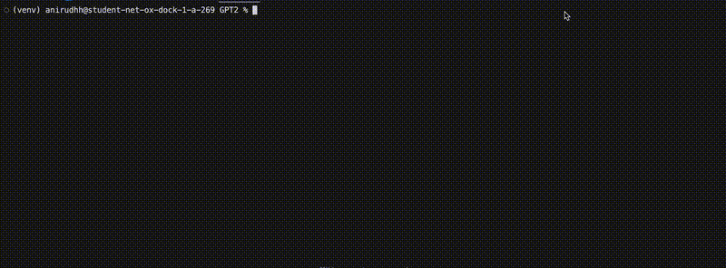

### Results & Evaluations

I ran gpt2.py for ~2 hours on an 8xA100 cluster using the 10B Token HugginggFace FineWebEdu dataset.

#### Training loss and HellaSwag Evals:

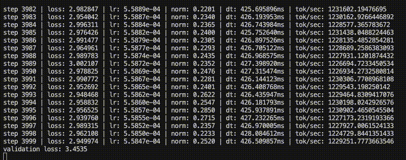

For evaluation, we track the validation loss and HellaSwag evaluation every 500 iterations.
[HellaSwag](https://paperswithcode.com/sota/sentence-completion-on-hellaswag) is a benchmark of many 4-multiple choice questions.
Given the initial prompt e.g: "the cat is about to" the model must predict the correct next completion from a set of 4 (e.g. "fly to the moon", TRUE: "cross the road", "read a book", "drive a car").
As the model trains & gets better, it will predict more and more correct hellaswag responses - thus it's a nice, continuous evaluation benchmark. Nowadays it's completed saturated (models get ~95% accuracy).

Results:
Our model gets a better loss than the original GPT-124M.
For the HellaSwag evaluation benchmark, it also beats OpenAI GPT2.
This is possibly due to a less broad training dataset (we are using HF FineWebEdu, whereas GPT2 from OpenAI also had coding/maths related data)

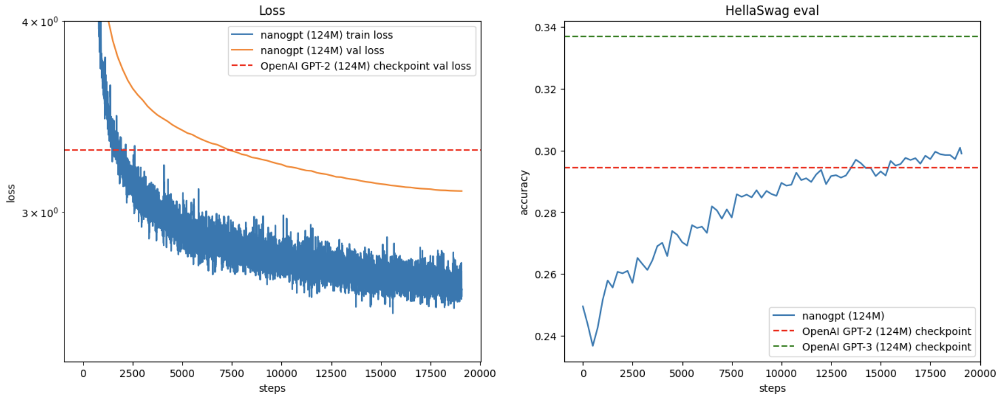

Additional results:

- Min Train Loss: 2.573763
- Min Validation Loss: 3.0944
- Max Hellaswag eval: 0.3009

## Technical details:

Here I give a summary of all the content covered, which also helps me actively recall all the details to training a massive neural net :)

### Objective

What is the goal we're trying to accomplish? Essentially, large language models are predicting the next words that appear, given the previous words.
To really nail this concept, we start with a simple 'bi-gram' model and gradually build up towards the Transformer model. Additionally, we work on the level of characters directly (for the smaller models) rather than using (BPE) tokens.

`1.Bigram -> 2.NN Bigram -> 3.Bengio -> 4.Wavenet -> 5.Transformer -> 6.GPT-2 (scaled up transformer)`

### Bi-gram model

File: `notebooks/bigram.ipynb`

In the simple bi-gram model, given a single previous character, we aim to predict the next most likely character.
For this, we work on the task of trying to generate 'realistic-sounding' names.

To do this, we basically want to process a bunch of names, and learn the frequency of the next-char given the previous char. I.e. for the character 'a', what are the frequencies of the next possible chars (e.g. b=300, c=200 i.e. given a, b appears 300 times, c appears 200 times, ...)

Concretely:

- Given a dataset of names `data/names.txt`, we read each name and create a dataset of character pairs. So e.g. `'emma'` becomes `['.e', 'em', 'mm', 'ma', 'a.']` where '.' signifies special 'beginning/end of name tokens.

Then we build a 2D array where for each first_char, we store the frequencies of the next_char. That looks something like this for our dataset

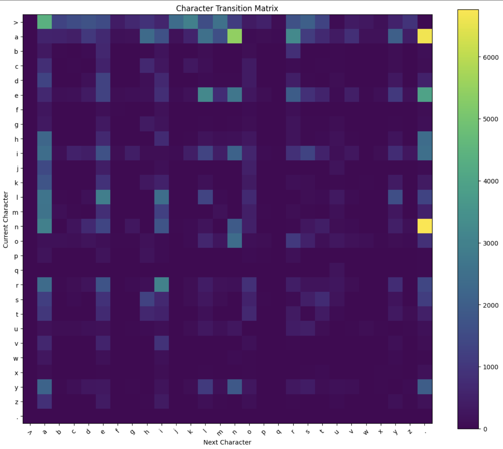

Then we can normalize this row-wise, and this gives us probabilities rather than counts.

Name generation:

- To generate names, we start with the special '.' beginning character, then continuously sample next_char from 2D normalized frequencies matrix until we reach a '.' end character.

Here's what our outputs look like:

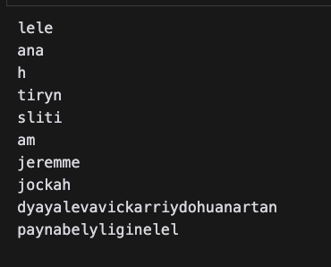

Obviously not great - we're predicting the next character based on only the previous character, and the model struggles to capture all the relations between chars.

### Neural Network model

File: `notebooks/simple_nn.ipynb`

To improve the bi-gram model, we'd want to increase the context we pass it - but this scales exponential (i.e. for 2 chars of context, we'd need to have a 3d matrix!)
Thus, we switch to a neural network model which gives us a lot more flexibility and scalability.

For the simple neural network model of the bigram:
Our input: the character index (just like bigram), but encoded as a one-hot vector (which is better for NN, as they don't work with discrete numbers)
Our output: the probabilities of the next possible chars (i.e. the plucked out row from the bigram model).

Our model is incredibly simple, we very simply just have a single output layer of 27 neurons (each neuron predicts that char's output probability given the input).

We need to train the neural network though. With just the neurons, the output of our NN will be a 27-dim vector which is the linear product of the one-hot vector with the neurons weights & bias - and result in a real number (i.e. negative or positive float).

We want to pull out the probabilities of the next chars though, thus we'll first want to get the 'counts' by exponentiating this output (this results in a strictly positive number).
Then, we sum across the output neurons and normalize the output to get a locally normalized probability between 0-1.

(Note: We don't use the sigmoid function (1 / (1 + e^-f(x))) typically used for binary/multi-class classification because it 1. allows row-wise sum to be above 1 probability (i.e. char 'a'=0.9 and 'b'=0.9 which doesn't allow us to predict the next char with certainty) 2. even if we normalize with the sum of the vector outputs, the sigmoid squashes the range between 0-1, thus reducing the difference between the predictions, which makes our predictions less 'sure'.).

Ok, so now we have the normalized probabilities of the output (we basically applied the softmax). We now need to be able to train our model to learn based on actual next-char.

For this, we take the negative log likelihood and sum this. By applying the log on a probability (range: 0-1), we get a negative number between -inf to 0 (log(~0) is near -inf, log(1) = 0). This is a good loss function, because when we select the ground-truth index from the output logits, we'd expect the probability to be higher (i.e. closer to 1). Thus if our actual logit is very close to 0, it increases the loss and thus it scales with how 'far off' our prediction is.

Here's our training loss from this model:

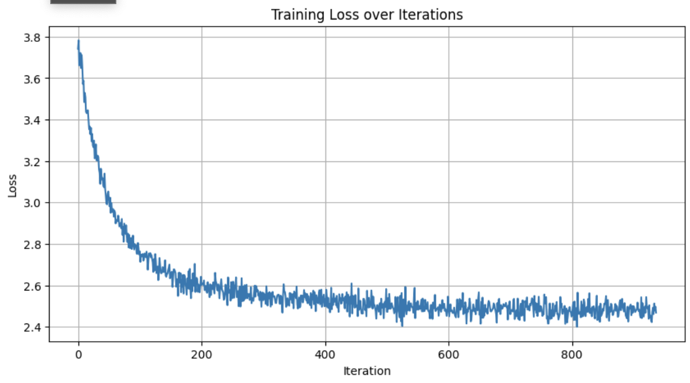

After training this, great we can make predictions and we basically get the same as the bigram model (which makes sense, as the bigram is the absolute way to model this task).

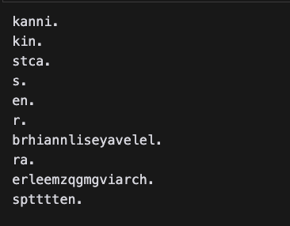

Now we want to scale up this model to take in more context as input (and not just the previous character).

### Bengio model

File: `notebooks/bengio_nn.ipynb`

In 2003, Bengio et al. introduced a more scalable way to make [next-token/char prediction](https://www.jmlr.org/papers/volume3/bengio03a/bengio03a.pdf).

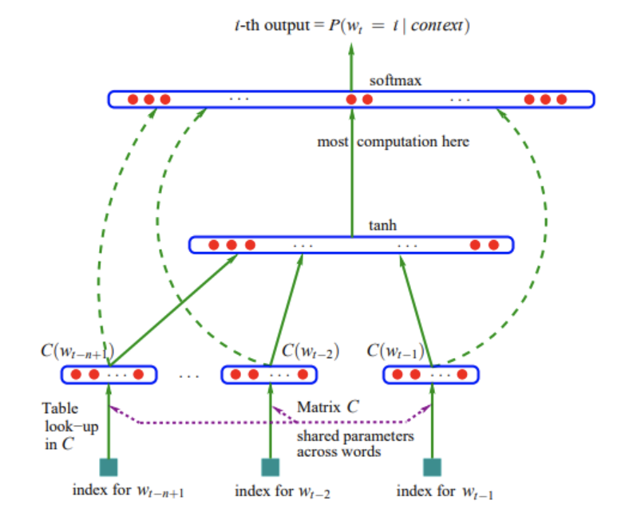

There are multiple improvements:

1. We use learnable embeddings instead of one-hot encoded vectors.
   This means we have a much more compact representation of each char. Additionally, since this is learnable, it means similar chars/words get mapped together and thus when we make predictions we'd expect these to also be interchangeable (e.g. 'the cat crossed the (pred: road)' should also be likely even if only 'the dog crossed the (pred:road)' was present in the training data, since cat and dog embeddings would have been learnt as similar to each other).

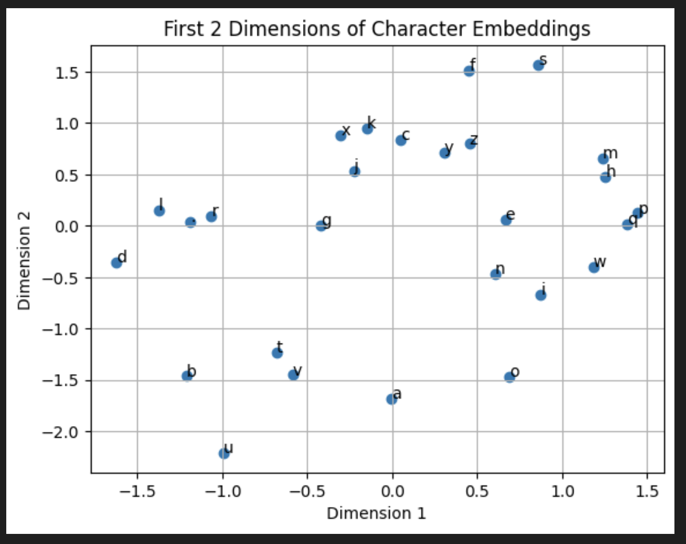

Here is an image of the embeddings being learned. I didn't train the model long enough, but notice in the bottom half the vowels are starting to cluster together (which makes sense, vowels are mostly similar/interchangeable in the context of a sentence).

2. We use a hidden layer before the output layer of vocab_size.
   The hidden layer allows us to spend more compute to identify hidden patterns/relations in our dataset (and thus better fit/model the data).
   We also concatenating context_size/block_size embeddings together as the input to the neural network - this allows us to increase the context size much more scalably than the bi-gram model.

As a result, our predictions get better (Actually, it got worse because I didn't train for long enough (was on a MBP CPU and didn't have easy access to GPU)).

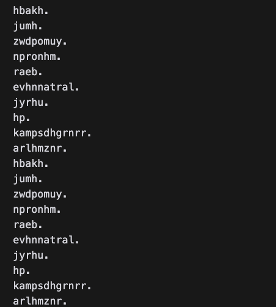

### Wavenet model

File: `notebooks/wavenet.ipynb`

Bengio model has its limitations. Even if we scale up the embedding size and the block size, our model loss does not decrease so significantly. A big reason is that we are compressing a block_size of previous chars into a single vector and then processing this in one go (i.e. a very lossy compression).

The [wavenet model introduced by Deepmind in 2016](https://arxiv.org/abs/1609.03499), gradually compressed the previous context (which allows more compute time to figure out the relations of words).

Here is a diagram of how that looks:

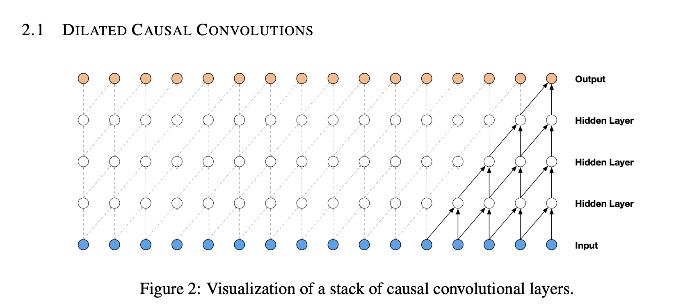

For the implementation, this is identical to bengio (i.e. inputs are embeddings, output logits are exponentiated and normalized vector (i.e. softmax) and then negative log of the ground-truth corresponding vector gives us the loss score.)

What does differ is that now we process the batch in a clever way: We pull the embeddings, flatten it into two, pass it through a linear layer and repeat.
The flatten layer is efficient since we're using PyTorch .view() operation which simply returns a different view of the data object (without data allocation/copying etc).

This leads to the same implementation as the wavenet, in a clean implementation.

Wavenet is when we start encountering our first deep neural network - we start to face the challenges of this such as vanishing/exploding gradients.

To diagnose this, we use various tools:

1. Scaling down the last layer init:
   If our vocab_size (i.e. possibilities for the next char == set(data)) is x, we would expect the average probability to be 1/x and thus the loss at init to be around -log(1/x)
   Typically, when we right our own layers from scratch, using a normal distribution, the loss is much higher. Instead, we'd want to scale it down using e.g. 0.01 so that our init output weights are quite uniform but also very small numbers (~1/x).

2. Dead neurons & exploding/vanishing gradients:
   When using activation functions, if we pass in hugely negative or positive values (i.e. outside [0-1] range), this leads 'saturating the activations. I.e. we are at the ends of the activation outputs where th gradient approaches 0.

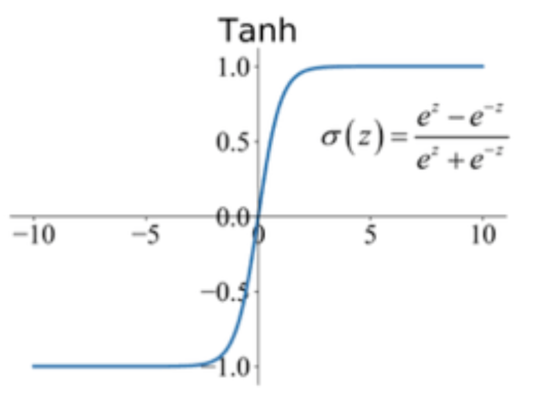

This is very very bad (and a big problem with deep networks with multiple layers). Why? Since the gradient is almost zero, when we backpropagate, we basically kill the backprop signal.

Concretely, the backprop function for the tanh activation's parent is `self.grad += (1-t**2) * out.grad`, thus when t==1 (at the extremities) we get the parent node.grad = (1-1) = 0 (the grad gets killed and so do all that nodes parents).

A look at a random computation graph (orange would be the tanh node, yellow would be it's parents. I.e. as we backprop, yellow.grad = 0 and thus in optimizer step it won't change (but also it's parents won't get gradient updates either and won't change!!) ):

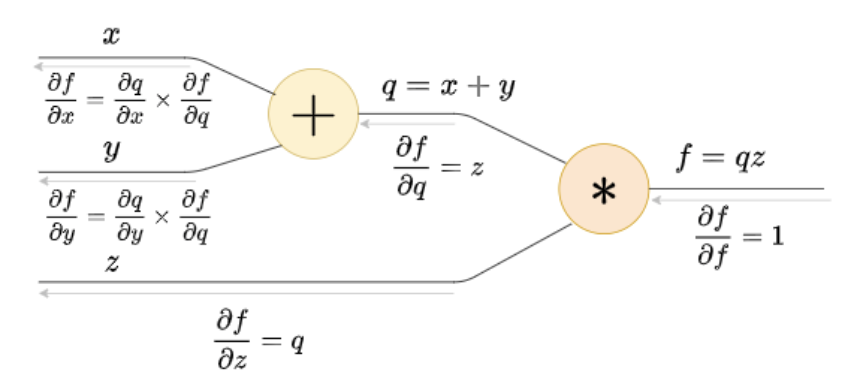

To fix this, we need to use 1. the kaiming init to ensure our pre-activations do not instantly saturate the activation functions (we want it to be roughly unit gaussian).
Additionally, this is where BatchNorm/LayerNorm comes in handy because it normalizes after each layer and ensure the output is roughly unit gaussian (and does not lead to dead neurons)

3. Gradient clipping:
   When we run with batches, we could occasionally get unlucky batches (i.e. very high gradients) which could shock our training (and make it longer, since we push it to a non-optimal direction). Thus we can clip the gradients to ensure if there's a big jump, it is not as strong a jump.

4. Residual networks to handle vanishing gradients & slow optimizations at bottom of deep NN
   In deep networks, we're performing many multiplications of small numbers, which leads to smaller and smaller gradients the deeper we backpropagate.
   A way to fix this is to add a '+' node at the top of the NN all the way back to the bottom of the NN (in the transformer architecture, we do this).

An addition direction branches the computation graph and splits the gradients equally. Thus when backpropagation, we directly 'fast-track' the backprop from the top of the NN all the way to the bottom. At the same time, we still backprop the gradients through the deep NN, which learn and slowly contribute more and more.

Here's what the wavenet generation output looks like on the shakespeare dataset:

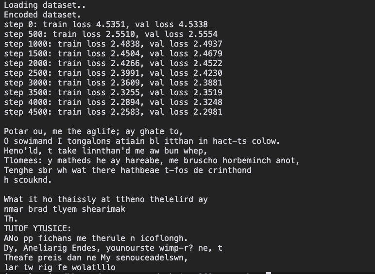

Obviously not great because I trained this on my Macbook Pro (with MPS), which still does not compare to an NVIDIA GPU :(

### Transformer model

File: `notebooks/transformer_nn.ipynb` and `scratch/transformer.py`

Finally, the transformer model.

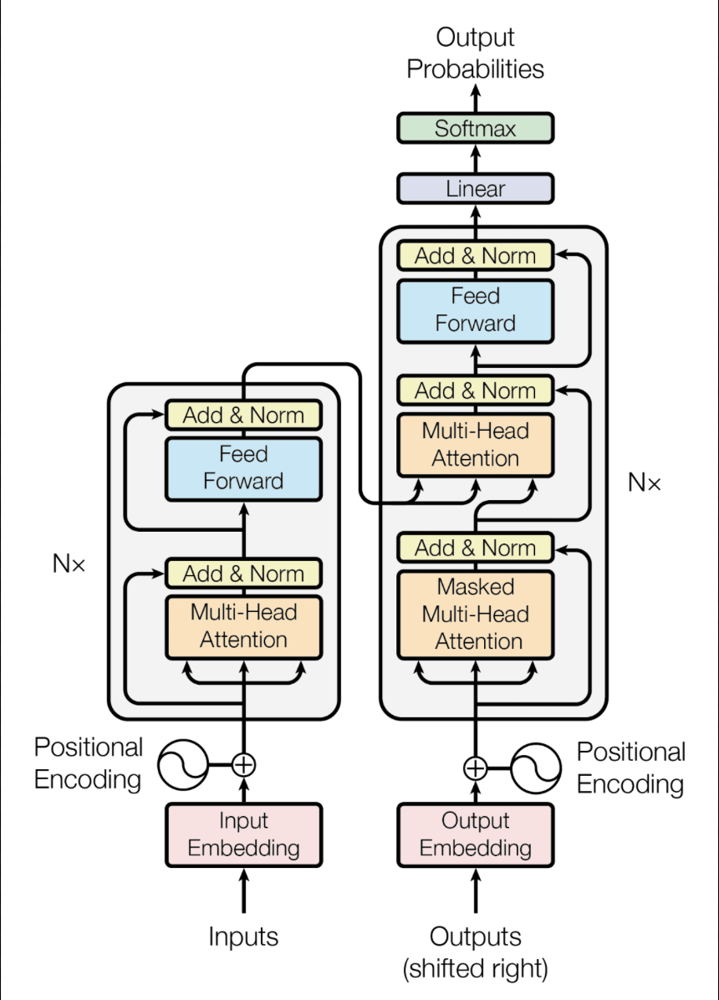

The transformer model is still similar to bengio - we tokenize our text (we use shakespeare in this case) and for each token of the input context we get the token embedding from a codebook/map.
This time, we also append the position of the token in the context (because otherwise we lose this information).

Now, we pass it through a special self-attention block, this is composed of an attention and a feed-forward network.

#### The attention component:

- Each token has a look at the previous tokens and assigns 'importance' weights to it. We thus assign varying importance to the tokens before us (and not uniform). We're thus 'focusing our compute' on only the parts that matter, and this significantly improves our model.

A bit more how this works: Each token in the context has a query (what it's looking for), key (what it can provide) and value (what it actually shares) - these are all NNs applied to the x = token_embed + pos_embed.

These are communicated through multiple 'channels' (multi-headed attention') and then concatenated into a single vector of embed size.
We additionally use tril to ensure each token only look at the previous context (and not the forward context, otherwise it's 'cheating' and not actually predicting the next tokens).

#### The feed-forward component:

- This is just a simple MLP which gives our model time to process the communications of the attention component.

We repeat this self-attention block many times and then connect it to an output layer of vocab_size to get the output logits/probabilities (which we can then -log to get the loss).

We can thus make predictions of the next token, given the input token context.

As before, we apply all the deep neural network tools (e.g. normalization, inits, ...) to ensure no problems with the gradient backpropagations and optimizations.

Our model performs far better and can actually start predicting sort-of-readable shakespeare text:
Insert here.

### GPT-2 model (i.e. scaling up the transformer)

File: `gpt2.py`

Here we scale up the Transformer model! We want to train equivalent to the GPT2 paper, i.e. a 124M parameter model (that's a lot of parameters!), but with the [10B dataset from HuggingFace FineWebEdu](https://huggingface.co/datasets/HuggingFaceFW/fineweb-edu) (a dataset of CommonCrawl that's filtered with LLMs for education content).
To actually train this, we'll use an 8xA100 cluster (I'm renting it from Vast.ai for about ~60CHF for full-training of 1hr (+ set up etc)).

Additionally, we want to make our training extremely efficient, there are many steps to this:

#### GPU/Architecture related optimisations

1. Use nice numbers:
   Most straightforward, make sure we use powers of 2 (because that's how GPU architectures are designed). If you have ugly/non-power-of-2 numbers, it could lead to not correctly fitting in the GPU streaming processors and thus additional passes or specialized kernels/padding etc and slower performance

2. Use TF32 (just one line of code)
   By default, our model is using FP32. However, we can use TF32 (mantissa is less i.e. less precision but that's okay for most ML purposes), which uses less memory. This theoretically can lead to 3x speed-up, but we see around 30% improvement (and this is probably because we are still memory-bound which is the main bottleneck for GPUs/training in general).

3. Use torch.compile:
   Another free one (except the upfront compilation cost). Torch automatically identifies nodes of multiple operations (e.g. loss = -log(exponentiate(x) / sum(exponentiate(x)))) and fuses them together in a single function (e.g. loss = f(x)). (Note this example is bad, just me being lazy haha).

   Without these 'fused' kernels, what happens is our GPU applies each operation one by one. It has to copy the data from the GPU HBM onto the GPU cores, apply the function, return it back to HBM and then repeat for the next function.
   The processors are extremely fast, but memory copying is very slow. HBM is also much slower than the registers/caches on the cores. Thus, fusing the multiple functions into a single one means we only copy our data once, apply all the functions, and return it back to the HBM (thus much less communication overhead).

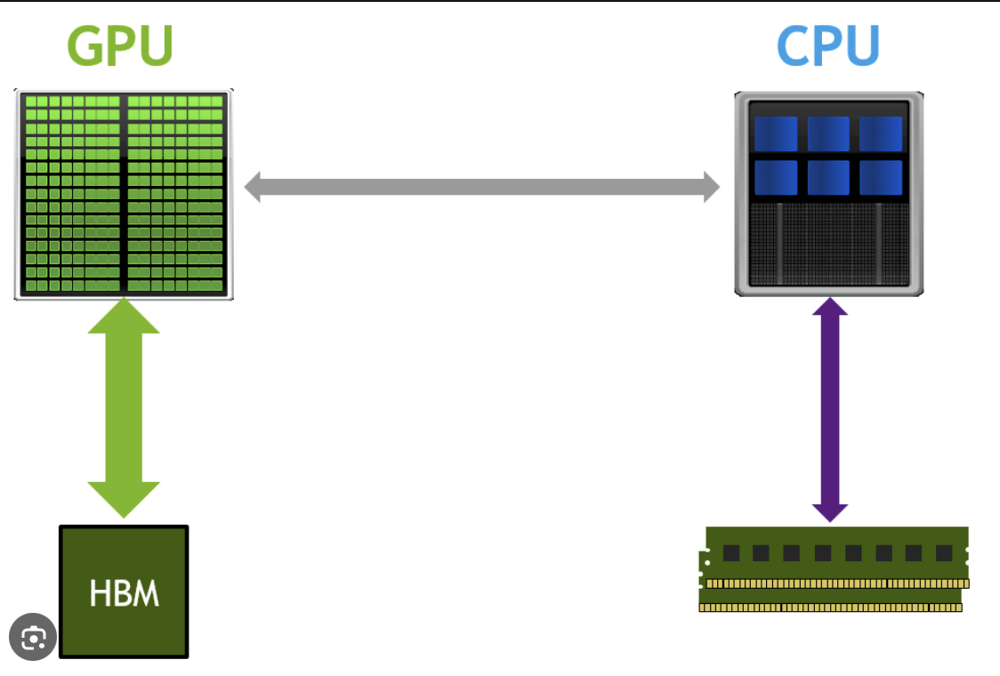

Torch.compile probably also does many more optimisations too.

4. Use BF16:
   In addition to the TF32, we can use BF16 (an even less precise floating point representation) which is supported by Ampere's series onwards GPUs.
   We apply BF16 to the forward pass & loss calculation only (using 'auto_cast') and it mainly uses it for the 2D arrays (e.g. matrix multiplied) tensors where the precision does not matter too much.
   These leads to less memory used (remember, we're memory bottlenecked!) and thus further speed up

5. Distributed Data Parallel:
   PyTorch's distributed training system. Since we're using 8 GPUs, we want to train on all of them in parallel batches. We design a special data loader (which allocates different batches to each GPU, using gpu rank/world_size (similar to MPI which I did in HPC at ETHZ)).
   All the GPUs load the model and train (using their batch)
   We can train and then we call loss.backwards() (with the DDP sync flag == True) which communicates all the weights and averages them out and then we optimizes the weights.

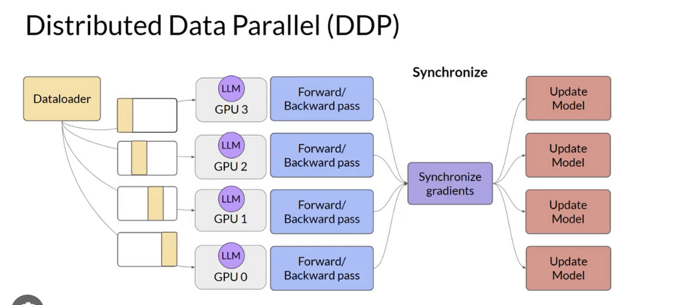

(Side note: Cool stuff - I definitely like working on stuff like this and did similar stuff for a [paper where I led the coding/implementation part and implemented a bloomfilter to minimize sparse matrix-matrix communication by 30%](https://drive.google.com/file/d/1qopGHeoYPdk5HrGPIBWW9fGWO3MgZnmH/view?usp=sharing))

#### ML related optimizations:

1. Applying the AdamW optimisation, which learns 2 momentum attributes to help it prevent getting stuck in local minimas and thus help our training converge faster
2. Cosine learning rate + warmup: Didn't dive much into this, probably many things work and this helps somehow escaping local minimas
3. Growing batch size: When we start, we can use very small batches because the estimates will be very off (and we're just squashing the characters of the vocab that are very rare to 0, thus optimisations in any direction will likely agree with most data samples). So we can optimize much faster at the beginning by using much smaller starting batch (but we didn't use for our GPT2)
4. We want to have large batches to have more stable training. GPT2 uses 500,000 batch size, if we do that our GPU will explode. So we have to accumulate the gradients over multiple 'micro_batches' that can fit onto the GPU memory and only backpropagate the grads when we hit the batch_size.

### Results

For results from training GPT-2, go to the top of this readme where I show HellaSwag evals and training loss.

## I think that's it?

I wrote this entire README.md from memory in ~ 1-2hrs of non-stop typing xD, that's probably everything (there are probably some minor details here and there I'm missing).

## Next Steps & Improvements

When I get time (lol), I'd probably work on fine-tuning this raw pre-trained model into a Q&A Chatbot model. I'd have to find/build a dataset of Q&A examples, and then train the pre-trained model for x iterations with the Q&A dataset.

It would also be very cool to try implement DeepSeek R1-style reasoning on top of the model or further RL on top of the LLM.

It probably would be hard to see much difference in the model given how small it is (and would cost me a lot of $$$)

### Model improvements

- Using RoPe encodings: this is implemented directly in the attention block and improves upon absolute position encodings, because we are storing relative positioning information (e.g. 'the cheese is in the fridge') is close to the 'fridge' rather than 'is in position 2 behind position 5 of fridge)

- FlashAttention3: Further speed improvements on top of FlashAttention could be applied to train/infer faster.

- Byte-latent Transformer: Interesting paper by Meta which shows that instead of the typical BPE tokenizer, we can learn the tokenization and this scales better. Probably make sense for me to implement this though because it is heavily scale dependent and I don't have [1M GPUs](https://techcrunch.com/2025/01/24/mark-zuckerberg-says-meta-will-have-1-3m-gpus-for-ai-by-year-end/) ;(

- DeepSeek V3 & DeepSeek R1: [Very cool research by the deepseek team](https://arxiv.org/pdf/2412.19437). For deepseek v3, they use MoE and multi-token prediction, something I'd be interested in implementing myself.

- To get a better feel for the scale, I'll eventually also read the [Llama 3 paper](https://arxiv.org/abs/2407.21783), training a 405B parameter model.

- Per-token loss tracking (in order to see how much each input sample contributed to the training) & seeing if this can be useful for unlearning. [Inspired by John Carmack](https://x.com/ID_AA_Carmack/status/1874931200697217049)

### Inference improvements:

If this model was actually deployed to production (sadly, economically for me, this would probably not make sense given the hundreds of existing pre-trained models), it would be cool to implement these:

- [Continuous batching](https://medium.com/@yohoso/llm-inference-optimisation-continuous-batching-2d66844c19e9): Immediately infer the next batch when we reach an end token

### Productisation

I would have to train for much longer, but if I do, some cool things I'd love to do:

- Deploy it to prod via AWS Sagemaker use the model for inference on my [blog chat project](https://blog-chatify.vercel.app) which has actual users
- Take the weights of the embedding layer and convert this into an embedding API service (and also use it for my blog chat project](https://blog-chatify.vercel.app)), exactly like [Mixedbread](https://www.mixedbread.ai).

If I find an extra week somewhere, maybe I'll do this haha (but it would mostly be to flex as I again don't have much users and it's completely unnecessarily overengineered when I could just use an existing API haha)

# Video demo

In case you're interested, I also made a video demo where I walk through all the details

# Acknowledgements

Karpathy is the best. Absolute insane that I can learn from one of the world's top ML researchers completely free, online, anytime.
Mindblowing. Thanks so much <3
